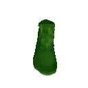

# Shap-E

This is the official code and model release for [Shap-E: Generating Conditional 3D Implicit Functions](https://arxiv.org/abs/2305.02463).

 * See [Usage](#usage) for guidance on how to use this repository.
 * See [Samples](#samples) for examples of what our text-conditional model can generate.

# Samples

Here are some highlighted samples from our text-conditional model. For random samples on selected prompts, see [samples.md](samples.md).

<table>
    <tbody>
        <tr>
            <td align="center">
                
            </td>
            <td align="center">
                
            </td align="center">
            <td align="center">
                
            </td>
        </tr>
        <tr>
            <td align="center">A chair that looks<br>like an avocado</td>
            <td align="center">An airplane that looks<br>like a banana</td>
            <td align="center">A spaceship</td>
        </tr>
        <tr>
            <td align="center">
                
            </td>
            <td align="center">
                
            </td>
            <td align="center">
                
            </td>
        </tr>
        <tr>
            <td align="center">A birthday cupcake</td>
            <td align="center">A chair that looks<br>like a tree</td>
            <td align="center">A green boot</td>
        </tr>
        <tr>
            <td align="center">
                
            </td>
            <td align="center">
                
            </td>
            <td align="center">
                
            </td>
        </tr>
        <tr>
            <td align="center">A penguin</td>
            <td align="center">Ube ice cream cone</td>
            <td align="center">A bowl of vegetables</td>
        </tr>
    </tbody>
<table>

# Usage

Install with `pip install -e .`.

# Shap-E 3D Generation API

Generate 3D models from text prompts using OpenAI's [Shap-E](https://github.com/openai/shap-e) and FastAPI.

---

##  Features

- Text-to-3D generation using Shap-E
- Downloads in `.glb`, `.obj`, `.ply`
- REST API with FastAPI
- Sample 3D outputs included

---

##  Setup Instructions

```bash
git clone https://github.com/YOUR_USERNAME/shap-e-api.git
cd shap-e-api
python3 -m venv venv
source venv/bin/activate
pip install -e ./shap-e
pip install -r requirements.txt
uvicorn main:app --reload

##  Sample Outputs

Click to download or preview:

-  [futuristic_helmet.glb](samples/futuristic_helmet.glb)
-  [futuristic_helmet.obj](samples/futuristic_helmet.obj)
-  [spaceship.glb](samples/spaceship.glb)

Preview online: [gltf-viewer.donmccurdy.com](https://gltf-viewer.donmccurdy.com/)

